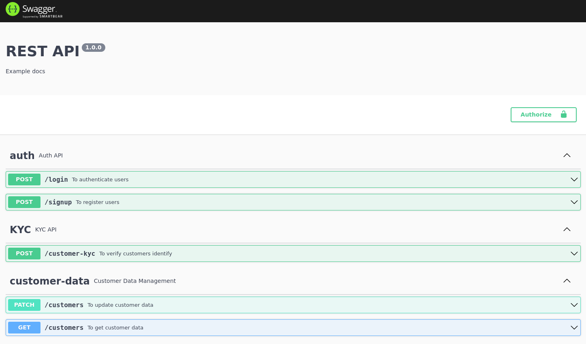

# Asset management app

Backend app that held users' assets

## Disclaimer / Limitation

This app is not fully functional but instead most of the parts are mocked, the idea is to demonstrate the components of how a financial related app should looks like.
I took the system design chance to demonstrate the flow and how the implementation should looks like.

### More detailed explanation refer to [Section 4](../sec4/README.md#backend-app-flow-and-implementation)

## How to use it

### Local

> Requires Docker v2 with compose feature

```bash
make db
yarn dev
```

## Swagger API Docs

Visit `localhost:3000/api-docs` after [starting app](#how-to-use-it)



## Code structure

```text
src/
├── app.ts # express app
├── config
├── controllers
├── database
├── dtos # data transfer object
├── entities
├── exceptions
├── http
├── interfaces
├── logs
├── middlewares # express middlewares
├── routes
├── server.ts # entry point
├── services
├── test
└── utils
```


