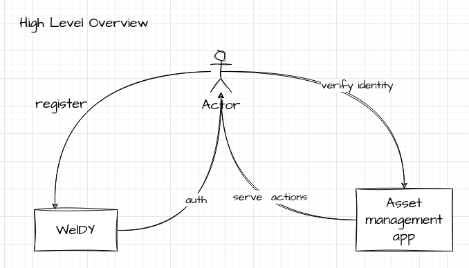
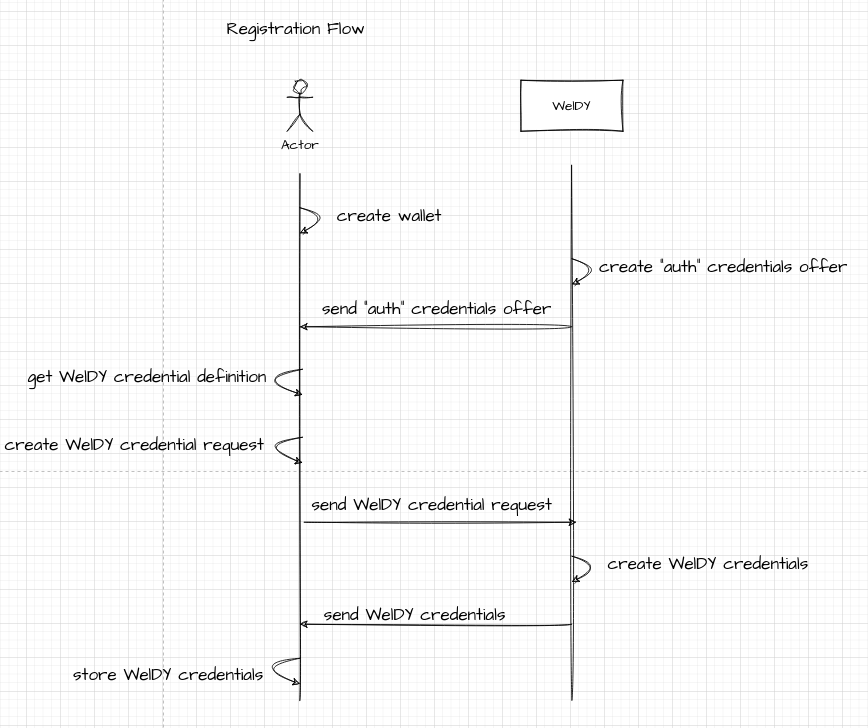
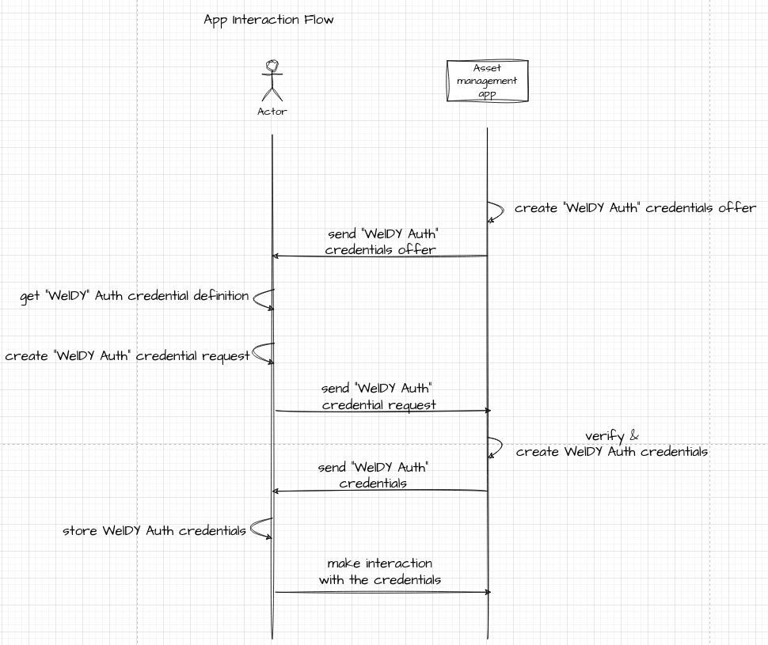
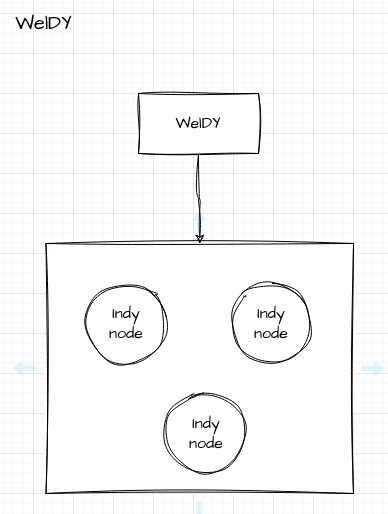
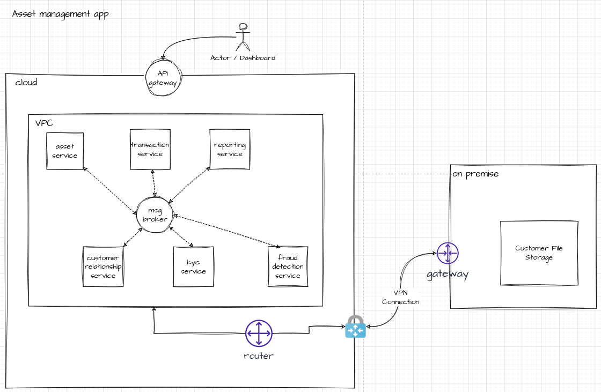
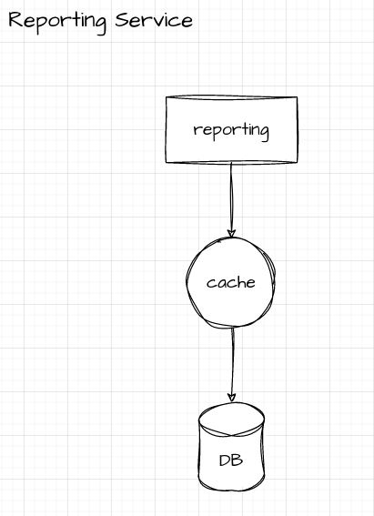
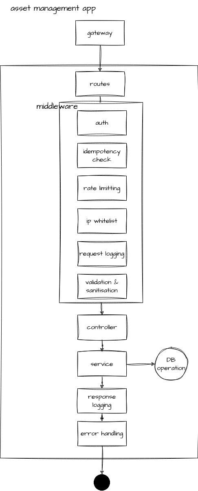

# Goal
- To apply decentralised methodology in granting users to access their assets

# High Level Overview

# Flow

## User registration flow

## App interaction flow

# System architecture
## WelDY

## Asset management backend

## Service Level

# Software requirements
## Database
- Postgres / MongoDB

## Cache
- redis

## Message Broker
- kafka

## Cloud Provider
- AWS
- Azure
- Can have both with multiple availability zones
	- to improve resiliency in case one provider down you still have another

## Orchestration
- k8s

## Infra builder
- terraform

## Backend App Flow and implementation

## Considerations

### Reconciliation

We can use cron to check from external party whenever we have items that have dangling state that is depends on the external source.

#### example scenario

##### Users purchased assets but external source has returned us gateway timeout

- in these scenarios, it's always safe to assume the transaction might processed by external source
- we need a cron to periodically ping their endpoint to check final status

### Idempotency check

To prevent double spending which could cost huge loses to both clients and business owner.

### Rate limiting

To prevent API being abused.

### IP whitelist

To provide flexibility for clients to allow access only their known servers only.

### Logging

Auditing purpose to easily trace back from an event / incident.